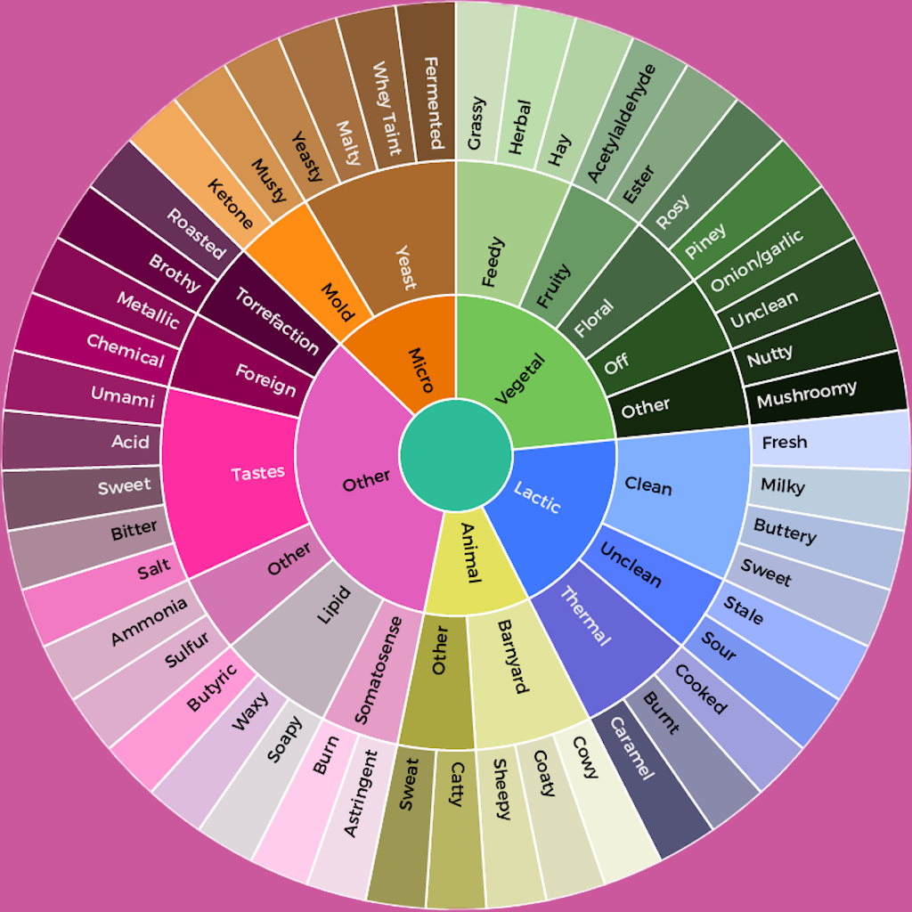

  

    
  

  

    
Aroma Assist

    

      Available in <b><a href="">AppStore</a></b>!
      Verfügbar im <b><a href="">AppStore</a></b>!
    

  

<h4>
  <b><i>Aroma Assist</i></b> 
  <b><i>Aroma Assist</i></b> 
</h4>

  <b><i>Aroma Assist</i></b> helps to determine aromes of several luxury foods. The well known <a href="https://en.wikipedia.org/wiki/Wine_tasting_descriptors">tasting wheels</a> are used as the underlying tool.
  <b><i>Aroma Assist</i></b> soll helfen, die Aromen diverser Genussmittel zu bestimmen. Dazu benutzt <i>Aroma Assist</i> die von <a href="https://de.wikipedia.org/wiki/Aromarad">Aromarädern</a> bekannte Methode.

  Aroma Assist's <b><a href="PrivacyPolicy.html">Privacy Policy</a></b>
  Aroma Assists <b><a href="PrivacyPolicy.html">Datenschutz-Richtlinie</a></b> 

 
