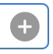
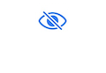

  

    
  

  

    

      
KTrunk

      
Getting StartedSchnelleinstieg

    

  

At the very first invocation the App looks a little bit strange. You land on the Settings page and can't too much.Beim ersten Aufruf erscheint die App zunächst einmal seltsam. Man landet auf der Einstellungs-Seite und kann damit zunächst einmal nicht viel anfangen.

Let's start ...Aber nun gehts los ...

<h4>
  Create a Note
  Erstellen einer Notiz
</h4>
<ul>
  <li>
    Click the Search symbol  at the top aside of the document title.
    Klicke auf das Such-Symbol   oben neben dem Dokumententitel.
  </li>
  <li>
    In the text entry field type the name of your Note.
    In dem Eingabefeld gibst Du den Namen Deiner Notiz ein.
  </li>
  <li>
    Click the little Plus symbol  within the text entry field ...
    Dann auf das kleine Plus-Symbol  in dem Eingabefeld klicken ...
  </li>
</ul>

... and you have created your first Note.... und schon hast Du Deine erste Notiz erstellt.

<h4>
  Edit a Note
  Bearbeiten einer Notiz
</h4>

  To edit a Note, click the Pencil symbol  at the top-right. Then position the cursor in the text and start <a href="Manual/EditMode.html">editing</a>.
  Um eine Notiz zu bearbeiten, klickst Du oben rechts auf das Bleistift-Symbol . Danach kannst Du den Cursor an die Stelle im Text positionieren, wo Du mit der <a href="Manual/EditMode.html">Bearbeitung</a> beginnen möchtest.

  For text formatting you have the usual symbols above the keyboard.
  Für die Formatierung des Textes stehen Dir oberhalb der Tastatur die üblichen Symbole zur Verfügung.

  Except the 3 (on iPad 4) right symbols they have no immediate impact, but phase in additional formatting symbols.
  Außer den 3 (auf dem iPad 4) rechten Symbolen haben diese Symbole keine direkte Wirkung, sondern blenden zusätzliche Formatierungssymbole ein.

  <b><i>Save</i></b> your modifications by clicking the checkmark at the top right.
  <b><i>Speichere</i></b> Deine Änderungen, indem Du das Häkchen oben rechts klickst.

  <b><i>Cancel</i></b> your modifications by clicking the crosshair left of the checkmark.
  <b><i>Verwerfe</i></b> Deine Änderungen, indem Du das Kreuz neben dem Speichern-Häkchen klickst.

  And when you have purchased the <i>Privacy</i> feature you even may <b><i>Encrypt</i></b> your note by clicking the striked eye  between checkmark and crosshair.
  Und wenn Du das <i>Privatsphären</i>-Feature erworben hast, kannst Du Deine Notiz sogar <b><i>Verschlüsselt</i></b> abspeichern, indem Du das durchgestrichene Auge  mm zwischen dem Speichern-Häkchen und dem Verwerfen-Kreuz klickst.

<h3>&nbsp;</h3>

  For further informations visit the <b><a href="Manual.html">Manual</a></b>.
  Weitere Informatinen findest Du im <b><a href="Manual.html">Handbuch</a></b>.

<h3>&nbsp;</h3>
