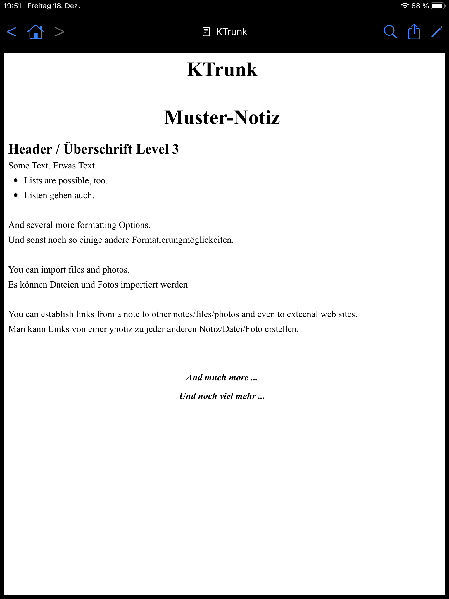

<table>
  <tr>
    <td width=150px style="border: 0px;"></td>
    <td style="border: 0px; padding-left: .5em; font-size: 5.0em;"><b><i>KTrunk</i></b></td> 
  </tr>
</table>

***Knowledge Trunk*** - or short ***KTrunk*** - is a note taking App. The notes are saved in html-format and can be synchronized across your devices using iCloud.
***Knowledge Trunk*** - oder kurz ***KTrunk*** - ist eine iOS-App, um Notizen zu verwalten.

Use ***KTrunk*** to save all your ideas augmented with related files and photos. You can establish links from one note to any other note or file in KTrunk.
Nutze ***KTrunk***, um all deine Ideen zu sammeln und sie mit Photos und beliebigen Dateien zu ergänzen. Von jeder Notiz aus kannst du in KTrunk Links zu anderen Notizen oder Dateien erstellen.

The notes are saved in html-format and can be synchronized across your devices using iCloud.
Die Notizen werden im html-Format abgespeichert und können mittels iCloud über alle deine iOS-Geräte synchronisiert werden.

The user interface is pretty simple. Most of the screen is just used to display the document. At the top you see the header bar that consists of:

<ul>
  <li>
    At the left is a block of Navigation Buttons.
    
  </li>
  <li>
    At the left is a block of Navigation Buttons.
    
  </li>
  <li>
    At the left is a block of Navigation Buttons.
    
  </li>
</ul>
  

 * At the left is a block of **[Navigation Buttons](Manual/NavigationButtons.md)**.9876
 * 1234[9iu6](Manual/NavigationButtons.md)
 

