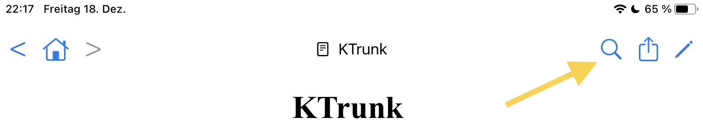

  

    
  

  

    

      
KTrunk

      
<a href="./../Manual.html">ManualHandbuch</a>

      
<a href="Index.html>Index</a>

    

  

<h1>
  Action Buttons
  Aktions-Schaltflächen
</h1>

<ul>
  <li>
    The  button shows the <b><a href="SearchDialog.html">Search Dialog</a></b>.
    Die  Schaltfläche ruft den <b><a href="SearchDialog.html">Such-Dialog</a></b> auf.
  </li>
  <li>
    The  button shows a sheet with <b><a href="FurtherActions.html">further Actions</a></b>.
    Die  Schaltfläche blendet <b><a href="FurtherActions.html">weitere Aktionen</a></b> ein.
  </li>
  <li>
    The  button switched into the <b><a href="EditMode.html">Edit Mode</a></b>.
    Die  Schaltfläche schaltet in den <b><a href="EditMode.html">Bearbeitungs-Modus</a></b> um.
  </li>
</ul>
