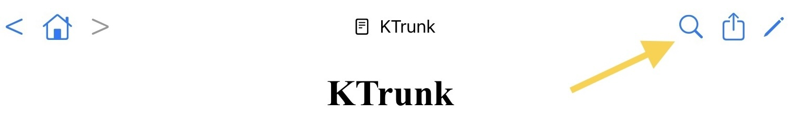

  

    
  

  

    
<a href="./../index.html">KTrunk</a>

    
<a href="./../Manual.html">ManualHandbuch</a>

    
<a href="Index.html">Index</a>

  

<h1>
  Action Buttons
  Aktions-Schaltflächen
</h1>

<ul>
  <li>
    The  button shows the <b><a href="SearchDialog.html">Search Dialog</a></b>.
    Die  Schaltfläche ruft den <b><a href="SearchDialog.html">Such-Dialog</a></b> auf.
  </li>
  <li>
    The  button shows a sheet with <b><a href="FurtherActions.html">further Actions</a></b>.
    Die  Schaltfläche blendet <b><a href="FurtherActions.html">weitere Aktionen</a></b> ein.
  </li>
  <li>
    The  button switched into the <b><a href="EditMode.html">Edit Mode</a></b>.
    Die  Schaltfläche schaltet in den <b><a href="EditMode.html">Bearbeitungs-Modus</a></b> um.
  </li>
  <ul>
     <li>
        If a note is encrypted you will see a  button instead of the  button. This button decrypts the note and presents it. <b>Attention:</b> Without the password used to encrypt the note you cannot decrypt it! It will be lost!
         Wenn eine Notiz verschlüsselt ist, ist statt der  Schaltfläche eine  Schaltfläche zu sehen. Mit dieser Schaltfläche wird die Notiz entschlüsselt und angezeigt. <b>Achtung:</b> Ohne das zur Verschlüsselung benutzte Passwort kann die Notiz nicht entschlüsselt werden! Sie ist dann verloren!
    </li>
     <li>
        If a file (ktFile) is presented you will see a  button instead of the  button. This button creates a corresponding note (ktNote) and presents it.
         Wenn Dateien (ktFiles) angezeigt werden, ist statt der  Schaltfläche eine  Schaltfläche zu sehen. Mit dieser Schaltfläche erzeugt man eine zugehörige Notiz (ktNote) bzw. zeigt eine schon existierende solche Notiz an.
    </li>
  </ul>
</ul>
