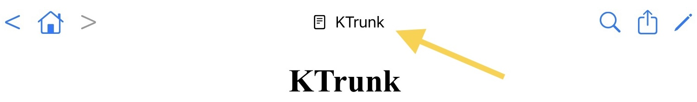

  

    
  

  

    
<a href="./../index.html">KTrunk</a>

    
<a href="./../Manual.html">ManualHandbuch</a>

    
<a href="Index.html">Index</a>

  

<h1>
  Document Title
  Dokumenten-Titel
</h1>

  The <i>Document Title</i> consists of 2 parts: The name of the document which is preceded by a small icont that reflects the type of the document. For the <i>HomePage</i> the  icon is used.
  Der <i>Dokumenten-Titel</i> besteht aus 2 Teilen: Dem Namen des Dokuments, dem ein kleines Bildchen vorgestellt ist, welches den Typ des Dokuments widerspiegelt. Für die <i>HomePage</i> wird das  Bildchen verwendet

<ul>
  <li>
    The   icon indicates that the document is a text <i>Note</i>. Such a <i>Note</i> you can <a href="EditMode.html">edit</a>.
    Das  Bildchen zeigt an, dass es sich um eine Text-<i>Notiz</i> handelt. Solch eine <i>Notiz</i> kann man <a href="EditMode.html">bearbeiten</a>.
  </li>
  <li>
    The  icon indicates that the document is a <i>File</i>. When you invoke the <a href="EditMode.html">edit</a> mode for a file, you will create a <i>Note</i> with the same name where you can make some further comments for the file.
    Das  Bildchen zeigt an, dass es sich um eine <i>Datei</i> handelt. Wenn man für solch eine Datei den <a href="EditMode.html">Bearbeitungs</a>-Modus aufruft, wird eine <i>Notiz</i> gleichen Namens erstellt, in der man zusätzliche Kommentare zu der Datei schreiben kann.
  </li>
  <ul>
    <li>
      If this icon is red it indicates that it is a special <i>File</i> type. KTrunk cannot extract the content of those files and therefore cannot maintain the index for this file automatically. By clicking this icon you get an appropriate hint and a recommendation how to behave.
      Wenn dieses Bildchen rot angezeigt wird, bedeutet dies, dass es sich um eine spezielle <i>Datei</i> handelt. KTrunk kann den Inhalt dieser Datei nicht auslesen und somit auch nicht automatisch den Index für diese Datei pflegen. Durch Anklicken dieses Bildchens erhält man eine entsprechende Meldung mit einem Hinweis, wie man sich verhalten kann.
    </li>
  </ul>
  <li>
    The  icon indicates that the document is not a local KTrunk document but from the world wide web.
    Das  Bildchen zeigt an, dass es sich nicht um ein lokales KTrunk-Dokument handelt, sondern aus dem World Wide Web stammt.
  </li>
</ul>

