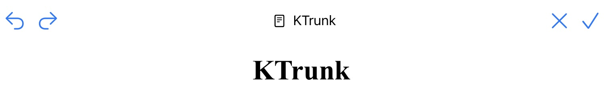
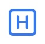
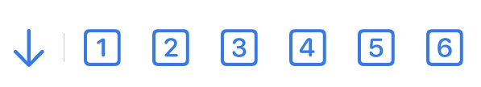
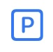

  

    
  

  

    

      
KTrunk

      
<a href="./../Manual.html">ManualHandbuch</a>

    

  

# Edit ModeBearbeitungs-Modus

In <i>Edit Mode</i> you can modify your Note. The header bar changes and has now at the left as well as at the right other buttons with other meaning.
Im <i>Bearbeitungs-Modus</i> kann man seine Notizen bearbeiten. Der Kopf-Bereich ändert sich und hat nun sowohl links als auch rechts andere Schaltflächen mit anderer Bedeutung.

When you are in the <i>Edit Mode</i> you may click into the text area and edit your Note.
Im <i>Bearbeitungs-Modus</i> kann man in den Text-Bereich klicken und die Notiz bearbeiten.

Above the keyboard there are some buttons to format the text, create links to other documents, or insert images. Except the 3 (on iPad 4) right buttons they have no immediate impact, but phase in additional formatting symbols.
Oberhalb der Tastatur sind ein paar Schaltflächen, um den Text zu formatieren, Links zu anderen Dokumenten zu erstellen oder um Bilder einzufügen. Außer den 3 (auf dem iPad 4) rechten Schaltflächen haben diese Symbole keine direkte Wirkung, sondern blenden zusätzliche Formatierungssymbole ein.

Here the meaning of the buttons:
Hier die Bedeutung der Schaltflächen:

<h3>The button  Die Schaltfläche </h3>

The <b>H</b>eader button spawns additional buttons which appear on top of the button on iPhones, between the left and right button-group on iPads.
Die <b>H</b>-Schaltfläche (<i>Header</i>) bringt weiter Schaltflächen zum Vorschein, die auf iPhones oberhalb der Schaltfläche, auf iPads zwischen den linken und rechten Schaltflächen-Gruppen erscheinen.

<h3>The buttons Die Schaltflächen </h3>

These buttons are used to set the header level of the paragraph from 1 to 6.
DieseSchaltflächen legen die Überschriften-Ebene von 1 bis 6 fest.

<h3>The button Die Schaltfläche </h3>

