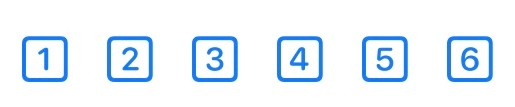
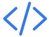
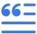
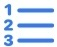
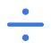

  

    
  

  

    

      
KTrunk

      
<a href="./../Manual.html">ManualHandbuch</a>

    

  

# Edit ModeBearbeitungs-Modus

In <i>Edit Mode</i> you can modify your Note. The header bar changes and has now at the left as well as at the right other buttons with other meaning.
Im <i>Bearbeitungs-Modus</i> kann man seine Notizen bearbeiten. Der Kopf-Bereich ändert sich und hat nun sowohl links als auch rechts andere Schaltflächen mit anderer Bedeutung.

When you are in the <i>Edit Mode</i> you may click into the text area and edit your Note.
Im <i>Bearbeitungs-Modus</i> kann man in den Text-Bereich klicken und die Notiz bearbeiten.

Above the keyboard there are some buttons to format the text, create links to other documents, or insert images. Except the 3 (on iPad 4) right buttons they have no immediate impact, but phase in additional formatting symbols.
Oberhalb der Tastatur sind ein paar Schaltflächen, um den Text zu formatieren, Links zu anderen Dokumenten zu erstellen oder um Bilder einzufügen. Außer den 3 (auf dem iPad 4) rechten Schaltflächen haben diese Symbole keine direkte Wirkung, sondern blenden zusätzliche Formatierungssymbole ein.

<h2>The meaning of the buttons:Die Bedeutung der Schaltflächen:</h2>

<h3>The button Die Schaltfläche </h3>

The <b>H</b>eader button spawns additional buttons which appear on top of the button on iPhones, between the left and right button-groups on iPads.
Die <b>H</b>-Schaltfläche (<i>Header</i>) bringt weitere Schaltflächen zum Vorschein, die auf iPhones oberhalb der Schaltfläche, auf iPads zwischen den linken und rechten Schaltflächen-Gruppen erscheinen.

  <h3>The buttons Die Schaltflächen </h3>

  These buttons are used to set the header level of the paragraph from 1 to 6.
  Diese Schaltflächen legen die Überschriften-Ebene von 1 bis 6 fest.

<h3>The button Die Schaltfläche </h3>

The <b>P</b>aragraph button spawns additional buttons which appear on top of the button on iPhones, between the left and right button-groups on iPads.
Die <b>P</b>aragraph-Schaltfläche bringt weitere Schaltflächen zum Vorschein, die auf iPhones oberhalb der Schaltfläche, auf iPads zwischen den linken und rechten Schaltflächen-Gruppen erscheinen.

  <h3>The button Die Schaltfläche </h3>

  
Sets the paragraph style to <i>normal</i>.
  Setzt den Paragraphen-Stil auf <i>normal</i>.

  
  <h3>The button Die Schaltfläche </h3>

  
Sets the paragraph style to <i>code-block</i>.
  Setzt den Paragraphen-Stil auf <i>Code-Block</i>.

  
  
This button appears with the -button of the right button group, too. But then it only formats the inline string to <i>code</i>.
  Diese Schaltfläche taucht auch auf, wenn man in der rechten Schaltflächen-Gruppe die -Schaltfläche klickt. Aber dann wird nur der InLine-String als <i>Code</i> formatiert.

  

  <h3>The button Die Schaltfläche </h3>

  Sets the paragraph style to <i>quote</i>.
  Setzt den Paragraphen-Stil auf <i>Zitat</i>.

  <h3>The button Die Schaltfläche </h3>

  Sets the paragraph style to <i>left aligned</i>.
  Setzt den Paragraphen-Stil auf <i>linksbündig</i>.

  <h3>The button Die Schaltfläche </h3>

  Sets the paragraph style to <i>centered</i>.
  Setzt den Paragraphen-Stil auf <i>zentriert</i>.

  <h3>The button Die Schaltfläche </h3>

  Sets the paragraph style to <i>right aligned</i>.
  Setzt den Paragraphen-Stil auf <i>rechtsbündig</i>.

<h3>The button Die Schaltfläche </h3>

The <b>L</b>ist button spawns additional buttons which appear on top of the button on iPhones, between the left and right button-groups on iPads.
Die <b>L</b>isten-Schaltfläche bringt weitere Schaltflächen zum Vorschein, die auf iPhones oberhalb der Schaltfläche, auf iPads zwischen den linken und rechten Schaltflächen-Gruppen erscheinen.

  <h3>The button Die Schaltfläche </h3>

  Sets the list style to <i>unordered</i>.
  Setzt den Listen-Stil auf <i>unsortiert</i>.
  
  <h3>The button Die Schaltfläche </h3>

  Sets the list style to <i>ordered</i>.
  Setzt den Listen-Stil auf <i>sortiert</i>.

<h3>The button Die Schaltfläche </h3>

This button spawns additional not so often used buttons which appear on top of the button on iPhones, between the left and right button-groups on iPads.
Diese Schaltfläche bringt weitere, nicht so häufig benötigte Schaltflächen zum Vorschein, die auf iPhones oberhalb der Schaltfläche, auf iPads zwischen den linken und rechten Schaltflächen-Gruppen erscheinen.

This button appears as well in the left as in the right button group. Depending on the containing group it spawns different buttons.
Diese Schaltfläche taucht sowohl in der linken als auch in der rechte Schaltflächen-Gruppe auf. Je nachdem, i welcher Gruppe man diese Schaltfläche klickt, werden unterschiedlich Schaltflächen angezeigt.

  <h3>The button Die Schaltfläche </h3>

  <i>Indents</i> the paragraph to the <i>right</i>. This can also be used to raise the level of lists or quotes.
  <i>Rückt</i> den Paragraphen nach <i>rechts</i> ein. Dies wird auch genutzt, um die Einzugsebene von Listen oder Zitaten zu erhöhen.
  
  <h3>The button Die Schaltfläche </h3>

  <i>Indents</i> the paragraph to the <i>left</i>. This can also be used to reduce the level of lists or quotes.
  <i>Rückt</i> den Paragraphen nach <i>links</i> ein. Dies wird auch genutzt, um die Einzugsebene von Listen oder Zitaten zu verringern.
  
  <h3>The button Die Schaltfläche </h3>

  <h3>The button Die Schaltfläche </h3>

  This button inserts a <i>horizontal rule</i>.
  Diese Schaltfläche fügt eine <i>Trennlinie</i> ein.

  <h3>The button Die Schaltfläche </h3>

  This button will insert a <code>clear: both;</code> html element into the document. This may help in some situations to get a clear formatting of the document.
  Diese Schaltfläche fügt ein <code>clear: both;</code> html-Element in das Dokument ein. Dies kann in einigen Situationen hilfreich sein, um wieder eine saubere Formatierung des Dokuments zu erreichen.

  <h3>The button Die Schaltfläche </h3>

  This button <i>clears all inline formatting</i>. This may be useful when content from other html-pages was copied, but you want to use the standard KTrunk formatting. Unfortunately, some KTrunk standard formatting is implemented using inline styles, which will be cleared, too.
  Hiermit werden alle <i>Inline-Formatierungen gelöscht</i>. Dies kann ganz nützlich sein, wenn man Inhalt von anderen Web-Seiten kopiert hat, ihn aber dem KTrunk-Standard entsprechend formatiert haben möchte. Dummerweise sind einige KTrunk-Formatierungen auch über Inline-Stile implementiert, die dabei auch veloren gehen.

