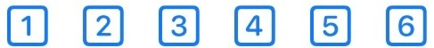
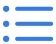
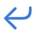

  

    
  

  

    
<a href="./../Manual.html">KTrunk</a>

    
<a href="./../Manual.html">ManualHandbuch</a>

    
<a href="Index.html">Index</a>

  

  

    
  

  

    

      
KTrunk

      
<a href="./../Manual.html">ManualHandbuch</a>

      
<a href="Index.html">Index</a>

    

  

<h1>
  Edit ModeBearbeitungs-Modus
</h1>

  In <i>Edit Mode</i> you can modify your Note. The header bar changes and has now at the left as well as at the right other buttons with other meaning.
  Im <i>Bearbeitungs-Modus</i> kann man seine Notizen bearbeiten. Der Kopf-Bereich ändert sich und hat nun sowohl links als auch rechts andere Schaltflächen mit anderer Bedeutung.

  When you are in the <i>Edit Mode</i> you may click into the text area and edit your Note.
  Im <i>Bearbeitungs-Modus</i> kann man in den Text-Bereich klicken und die Notiz bearbeiten.

  At the top left you see two buttons.
  Oben links findet man zwei Schaltflächen.

<ul>
  <li>
    With the  button you can undo your modifications.
    Mit der  Schaltfläche kann man seine Änderungen rückgängig machen.
  </li>
  <li>
    With the  button you can redo your undone modifications.
    Mit der  Schaltfläche kann man seine rückgängig gemachten Änderungen wiederherstellen.
  </li>
</ul>

  At the top right you see three buttons.
  Oben rechts findet man drei Schaltflächen.

<ul>
  <li>
    With the  button you can cancel your modifications.
    Mit der  Schaltfläche kann man seine Änderungen verwerfen.
  </li>
  <li id="Encryption">
    With the  button you can <b>encrypt your note</b>. <b>Warning:</b> The password to encrypt the note is <b>required</b> to decrypt the note. If you forget it there is no chance to get the note back.
    Mit der  Schaltfläche kann man seine <b>Notiz verschlüsseln</b>. <b>Warnung:</b> Das zur Verschlüsselung notwendige Passwort ist <b>erforderlich</b>, um die Notiz wieder zu entschlüsseln. Wenn es vergessen wird, gibt es keine Möglichkeit mehr, die Notiz wiederzubekommen.
  </li>
  <li>
    With the  button you can save your modifications.
    Mit der  Schaltfläche kann man seine Änderungen speichern.
  </li>
</ul>

  Above the keyboard there are some buttons to format the text, create links to other documents, or insert images. Except the 3 (on iPad 4) right buttons they have no immediate impact, but phase in additional formatting symbols.
  Oberhalb der Tastatur sind ein paar Schaltflächen, um den Text zu formatieren, Links zu anderen Dokumenten zu erstellen oder um Bilder einzufügen. Außer den 3 (auf dem iPad 4) rechten Schaltflächen haben diese Symbole keine direkte Wirkung, sondern blenden zusätzliche Formatierungssymbole ein.

<h2>
  The meaning of the buttons above the keyboard:Die Bedeutung der Schaltflächen oberhalb der Tastatur:
</h2>
<h3>
  The button 
  Die Schaltfläche 
</h3>

  The <b>H</b>eader button spawns additional buttons which appear on top of the button on iPhones, between the left and right button-groups on iPads.
  Die <b>H</b>-Schaltfläche (<i>Header</i>) bringt weitere Schaltflächen zum Vorschein, die auf iPhones oberhalb der Schaltfläche, auf iPads zwischen den linken und rechten Schaltflächen-Gruppen erscheinen.

  <h3>
    The buttons 
    Die Schaltflächen 
  </h3>
  

    These buttons are used to set the header level of the paragraph from 1 to 6.
    Diese Schaltflächen legen die Überschriften-Ebene von 1 bis 6 fest.
  

<h3>
  The button 
  Die Schaltfläche 
</h3>

  The <b>P</b>aragraph button spawns additional buttons which appear on top of the button on iPhones, between the left and right button-groups on iPads.
  Die <b>P</b>aragraph-Schaltfläche bringt weitere Schaltflächen zum Vorschein, die auf iPhones oberhalb der Schaltfläche, auf iPads zwischen den linken und rechten Schaltflächen-Gruppen erscheinen.

  <h3>
    The button 
    Die Schaltfläche 
  </h3>
  

    Sets the paragraph style to <i>normal</i>.
    Setzt den Paragraphen-Stil auf <i>normal</i>.
  

  <h3>
    The button 
    Die Schaltfläche 
  </h3>
  

    Sets the paragraph style to <i>code-block</i>.
    Setzt den Paragraphen-Stil auf <i>Code-Block</i>.
  
  
  

    This button appears with the -button of the right button group, too. But then it only formats the inline string to <i>code</i>.
    Diese Schaltfläche taucht auch auf, wenn man in der rechten Schaltflächen-Gruppe die -Schaltfläche klickt. Aber dann wird nur der InLine-String als <i>Code</i> formatiert.
  

  <h3>
    The button 
    Die Schaltfläche 
  </h3>
  

    Sets the paragraph style to <i>quote</i>.
    Setzt den Paragraphen-Stil auf <i>Zitat</i>.
  

  <h3>
    The button 
    Die Schaltfläche 
  </h3>
  

    Sets the paragraph style to <i>left aligned</i>.
    Setzt den Paragraphen-Stil auf <i>linksbündig</i>.
  

  <h3>
    The button 
    Die Schaltfläche 
  </h3>
  

    Sets the paragraph style to <i>centered</i>.
    Setzt den Paragraphen-Stil auf <i>zentriert</i>.
  

  <h3>
    The button 
    Die Schaltfläche 
  </h3>
  

    Sets the paragraph style to <i>right aligned</i>.
    Setzt den Paragraphen-Stil auf <i>rechtsbündig</i>.
  

<h3>
  The button 
  Die Schaltfläche 
</h3>

  The <b>L</b>ist button spawns additional buttons which appear on top of the button on iPhones, between the left and right button-groups on iPads.
  Die <b>L</b>isten-Schaltfläche bringt weitere Schaltflächen zum Vorschein, die auf iPhones oberhalb der Schaltfläche, auf iPads zwischen den linken und rechten Schaltflächen-Gruppen erscheinen.

  <h3>
    The button 
    Die Schaltfläche 
  </h3>
  

    Sets the list style to <i>unordered</i>.
    Setzt den Listen-Stil auf <i>unsortiert</i>.
  

  <h3>
    The button 
    Die Schaltfläche 
  </h3>
  

    Sets the list style to <i>ordered</i>.
    Setzt den Listen-Stil auf <i>sortiert</i>.
  

<h3>
  The button  in the left button group
  Die Schaltfläche  in der linken Schaltflächen-Gruppe
</h3>

  This button spawns additional not so often used buttons which appear on top of the button on iPhones, between the left and right button-groups on iPads.
  Diese Schaltfläche bringt weitere, nicht so häufig benötigte Schaltflächen zum Vorschein, die auf iPhones oberhalb der Schaltfläche, auf iPads zwischen den linken und rechten Schaltflächen-Gruppen erscheinen.

  This button appears as well in the left as in the right button group. Depending on the containing group it spawns different buttons.
  Diese Schaltfläche taucht sowohl in der linken als auch in der rechte Schaltflächen-Gruppe auf. Je nachdem, in welcher Gruppe man diese Schaltfläche klickt, werden unterschiedlich Schaltflächen angezeigt.

  <h3>
    The button 
    Die Schaltfläche 
  </h3>
  

    <i>Indents</i> the paragraph to the <i>right</i>. This can also be used to raise the level of lists or quotes.
    <i>Rückt</i> den Paragraphen nach <i>rechts</i> ein. Dies wird auch genutzt, um die Einzugsebene von Listen oder Zitaten zu erhöhen.
  

  <h3>
    The button 
    Die Schaltfläche 
  </h3>
  

    <i>Indents</i> the paragraph to the <i>left</i>. This can also be used to reduce the level of lists or quotes.
    <i>Rückt</i> den Paragraphen nach <i>links</i> ein. Dies wird auch genutzt, um die Einzugsebene von Listen oder Zitaten zu verringern.
  
  
  <h3>
    The button 
    Die Schaltfläche 
  </h3>
  

    This button opens a dialog to specify table dimensions. After commiting the table will be inserted at the cursor position.
    Diese Schaltfläche öffnet einen Dialog, um Tabellen-Dimensionen festzulegen. Nach der Bestätigung wird eine entsprechende Tabelle an der Cursor-Position eingefügt.
    If the cursor is inside of a table when clicking this button, the dimensions of this table will shown and can be adjusted.
    Falls sich der Cursor schon innerhalb einer Tabelle befindet, wenn man die Schaltfläche klickt, werden die Dimensionen dieser Tabelle angezeigt und können angepasst werden.
  
  
  

    If the table contains a header row, a click on a cell in the header row will <a href="./TipsAndTricks.html#TableSort">sort</a> the table&#39;s body according to data in the clicked column.
    Falls die Tabelle eine Kopfzeile enthält, kann man die Daten in dem Tabellenkörper mit einem Klick auf eine Zelle in der Kopfzeile entsprechend den Daten in der angeklickten Spalte <a href="./TipsAndTricks.html#TableSort">sortieren</a>.
  
  
  <h3>
    The button 
    Die Schaltfläche 
  </h3>
  

    This button inserts a <i>horizontal rule</i>.
    Diese Schaltfläche fügt eine <i>Trennlinie</i> ein.
  

  <h3>
    The button 
    Die Schaltfläche 
  </h3>
  

    This button will insert a <code>clear: both;</code> html element into the document. This may help in some situations to get a clear formatting of the document.
    Diese Schaltfläche fügt ein <code>clear: both;</code> html-Element in das Dokument ein. Dies kann in einigen Situationen hilfreich sein, um wieder eine saubere Formatierung des Dokuments zu erreichen.
  

  <h3>
    The button 
    Die Schaltfläche 
  </h3>
  

    This button <i>clears all inline formatting</i>. This may be useful when content from other html-pages was copied, but you want to use the standard KTrunk formatting. Unfortunately, some KTrunk standard formatting is implemented using inline styles, which will be cleared, too.
    Hiermit werden alle <i>Inline-Formatierungen gelöscht</i>. Dies kann ganz nützlich sein, wenn man Inhalt von anderen Web-Seiten kopiert hat, ihn aber dem KTrunk-Standard entsprechend formatiert haben möchte. Dummerweise sind einige KTrunk-Formatierungen auch über Inline-Stile implementiert, die dabei auch verloren gehen.
  

<h3>
  The button  in the right button group
  Die Schaltfläche  in der rechten Schaltflächen-Gruppe
</h3>

  This button spawns additional not so often used buttons which appear on top of the button on iPhones, between the left and right button-groups on iPads.
  Diese Schaltfläche bringt weitere, nicht so häufig benötigte Schaltflächen zum Vorschein, die auf iPhones oberhalb der Schaltfläche, auf iPads zwischen den linken und rechten Schaltflächen-Gruppen erscheinen.

  <h3>
    The button 
    Die Schaltfläche 
  </h3>
  

    Formats the selected text as <i>superscript</i>.
    Formatiert den selektierten Text <i>hochgestellt</i>.
  

  <h3>
    The button 
    Die Schaltfläche 
  </h3>
  

    Formats the selected text as <i>subscript</i>.
    Formatiert den selektierten Text <i>tiefgestellt</i>.
  
  
  <h3>
    The button 
    Die Schaltfläche 
  </h3>
  

    <i>Strikes</i> the selected text <i>through</i>.
    <i>Streicht</i> den selektierten Text <i>durch</i>.
  

  <h3>
    The button 
    Die Schaltfläche 
  </h3>
  

    <i>Underlines</i> the selected text.
    <i>Unterstreicht</i> den selektierten Text.
  

  <h3>
    The button 
    Die Schaltfläche 
  </h3>
  

    Formats the selected text to <i>code-block</i>.
    Formatiert den selektierten Text als <i>code-block</i>.
  

  <h3>
    The button 
    Die Schaltfläche 
  </h3>
  

    The button inserts a line-break without starting a new paragraph.
    Die Schaltfläche erzeugt einen Zeilenumbruch, ohne einen neuen Absatz zu beginnen.
  

<h3>
  The button 
  Die Schaltfläche 
</h3>

  This button spawns a dialog that lets you select an image from within KTrunk, which will be inserted at the cursor position.
  Diese Schaltfläche startet einen Dialog, in dem man ein in KTrunk gespeichertes Image selektieren kann, dass dann an der aktuellen Cursor-Position eingefügt wird.

  On iPhones this button is <i>hidden</i> behind the right  button.
  Auf iPhones <i>verbirgt</i> sich diese Schaltfläche hinter der rechten-Schaltfläche.

<h3>
  The button 
  Die Schaltfläche 
</h3>

  This button highlights the selected text.
  Diese Schaltfläche markiert den selektierten Text.

<h3>
  The button 
  Die Schaltfläche 
</h3>

  This button formats the selected text as italic.
  Diese Schaltfläche formatiert den selektierten Text kursiv.

<h3>
  The button 
  Die Schaltfläche 
</h3>

  This button formats the selected text as bold.
  Diese Schaltfläche formatiert den selektierten Text fett.

