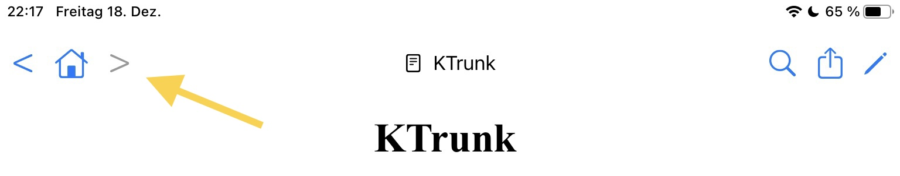

  

    
  

  

    
<a href="./../index.html">KTrunk</a>

    
<a href="./../Manual.html">ManualHandbuch</a>

    
<a href="Index.html">Index</a>

  

<h1>
  Navigation Buttons
  Navigations-Schaltflächen
</h1>

  The 3 <b><i>Navigation Buttons</i></b> have the usual meaning as it is well known from web browsers.
  Die 3 <b><i>Navigations-Schaltflächen</i></b> haben die übliche Bedeutung, wie sie von vielen Web-Browsern bekannt ist.

<ul>
  <li>
    The  button goes back one step in the history of visited pages.
    Die  Schaltfläche führt in der Historie der besuchten Web-Seiten einen Schritt zurück.
  </li>
  <li>
    The  button goes forward one step in the history of visited pages. The sample button is <i>grayed-out</i> meaning that the button is <i>inactive</i>.
    Die  Schaltfläche führt in der Historie der besuchten Web-Seiten einen Schritt vorwärts. Die hier gezeigte Beispiel-Schaltfläche ist <i>ausgegraut</i>, d.h. sie ist <i>nicht aktiviert</i>.
  </li>
  <li>
    The  button loads the <i>Home Page</i> that you have specified in your <i><a href="Settings.html">Settings</a></i>.
    Die  Schaltfläche lädt die <i>Home Page</i>, die in den <i><a href="Settings.html">Einstellungen</a></i> festgelegt wurde.
  </li>
</ul>
