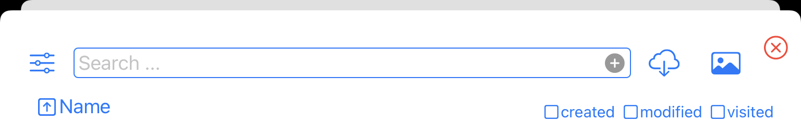

  

    
  

  

    

      
KTrunk

      
<a href="./../Manual.html">ManualHandbuch</a>

    

  

<h1>
  Search DialogSuch-Dialog
</h1>

  The <i>SearchDialog</i> appears when you click the  button.
  Der <i>Such-Dialog</i> erscheint, wenn man die  Schaltfläche anklickt.

  With the  button at the top left you invoke the <a href="Settings.html">Settings</a>.
  Mit der  Schaltfläche oben links gelangt man zu den <a href="Settings.html">Einstellungen</a>.

  At the right are two buttons. With the  button you can import files into KTrunk. With the  button you can import photos into KTrunk.
  Auf der rechten Seite sind zwei Schaltflächen. Mit der  Schaltfläche kann man Dateien nach KTrunk importieren. Mit der  Schaltfläche kann man Fotos nach KTrunk importieren.

&nbsp;

