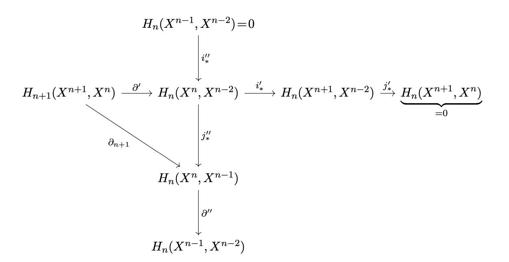
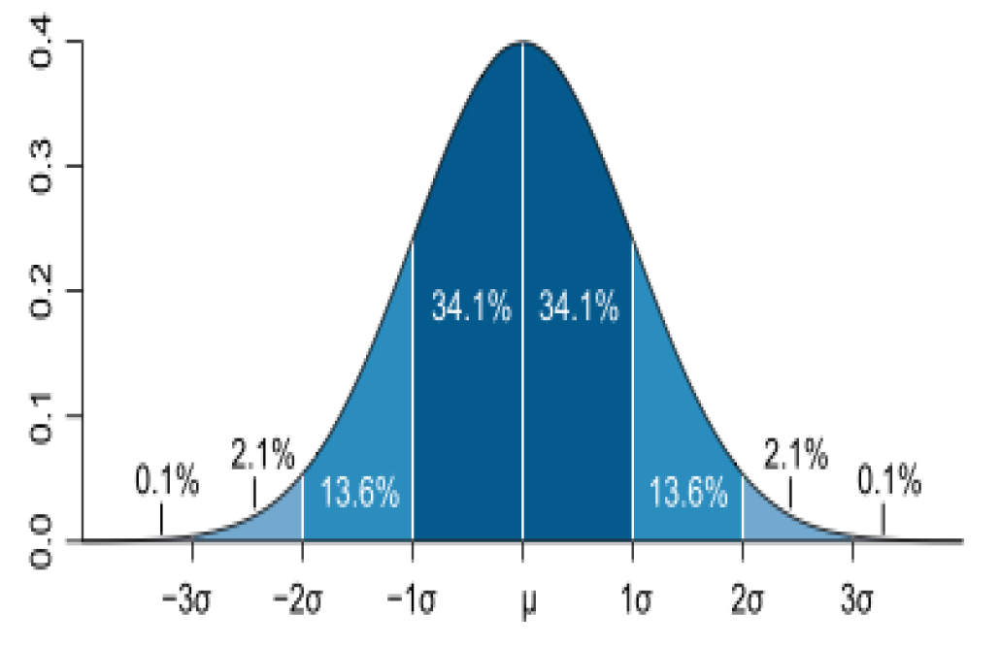
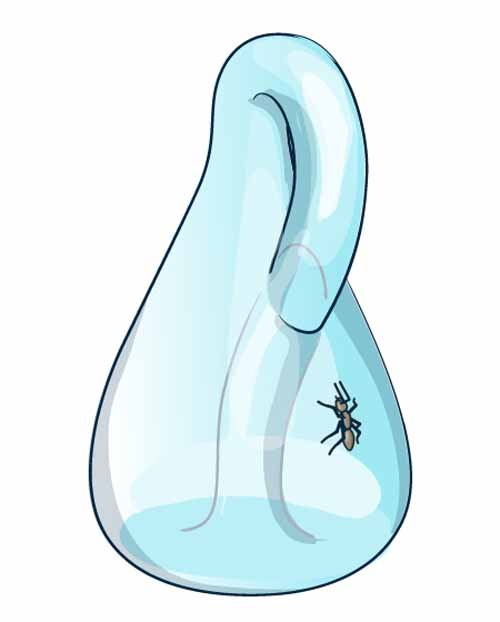

  

    &nbsp;
  

  

    

      Mathematics
      Mathematik
    

  

  

    
  

  

    
<a href="Diplomarbeit/Diplomarbeit.pdf">Hindernisse gegen die Glättung von Poincaré-Räumen</a>

    
My Diploma Thesis from 1983Meine Diplomarbeit aus dem Jahre 1983

  

  

    
  

  

    
<a href="Wahrscheinlichkeitsrechnung/index.html">Probability TheoryWahrscheinlichkeitsrechnung</a>

    

      
    

  

  

    
  

  

    
<a href="Topologie/index.html">TopologyTopologie</a>

    

      
    

  

  

  

    &nbsp;
  

  

    

      My iOS Apps
      Meine iOS-Apps
    

  

  

    
  

  

    
<a href="KTrunk/index.html">KTrunk</a>

    

      <b><i>Knowledge Trunk</i></b> — or short <b><i>KTrunk</i></b> — is a note taking iOS-App.
      <b><i>Knowledge Trunk</i></b> — oder kurz <b><i>KTrunk</i></b> — ist eine iOS-App, um Notizen zu verwalten.
    

  

  

    
  

  

    
<a href="IntervalCoach/index.html">IntervalCoach</a>

    

      <b><i>IntervalCoach</i></b> is a simple, easy-to-use interval timer.
      <b><i>IntervalCoach</i></b> ist ein einfacher, benutzerfreundlicher Intervall-Timer.
    

  

  

    
  

  

    
<a href="Zebulon/index.html">Zebulon</a>

    

        <b><i>Zebulon</i></b> - a medieval game.
        <b><i>Zebulon</i></b> - ein mittelalterliches Spiel.
    

  

  

    
&nbsp;

  

  

    

      <a href="IT-Training/Profile.html">IT-Training</a>
    

    

   

      After spending nearly 40 years supporting the mainframe DBMS Db2, I now have decided to offer my knowledge as an independent consultant.
      Nach beinahe 40 Jahren intensiver Beschäftigung mit dem Mainframe DBMS Db2, habe ich mich entschieden, meine gesammelten Erfahrungen als unhabhängiger Berater zur Verfügung zu stellen.
    

    

      If you are interested to profit from my experience, don't hesitate to <a href="mailto:cl.schuetzdeller@icloud.com">contact me</a>.
      Zögern Sie nicht, <a href="mailto:cl.schuetzdeller@icloud.com">Kontakt mit mir aufzunehmen</a>, wenn Sie Interesse haben, von meinen Erfahrungen zu profitieren.
    

    

