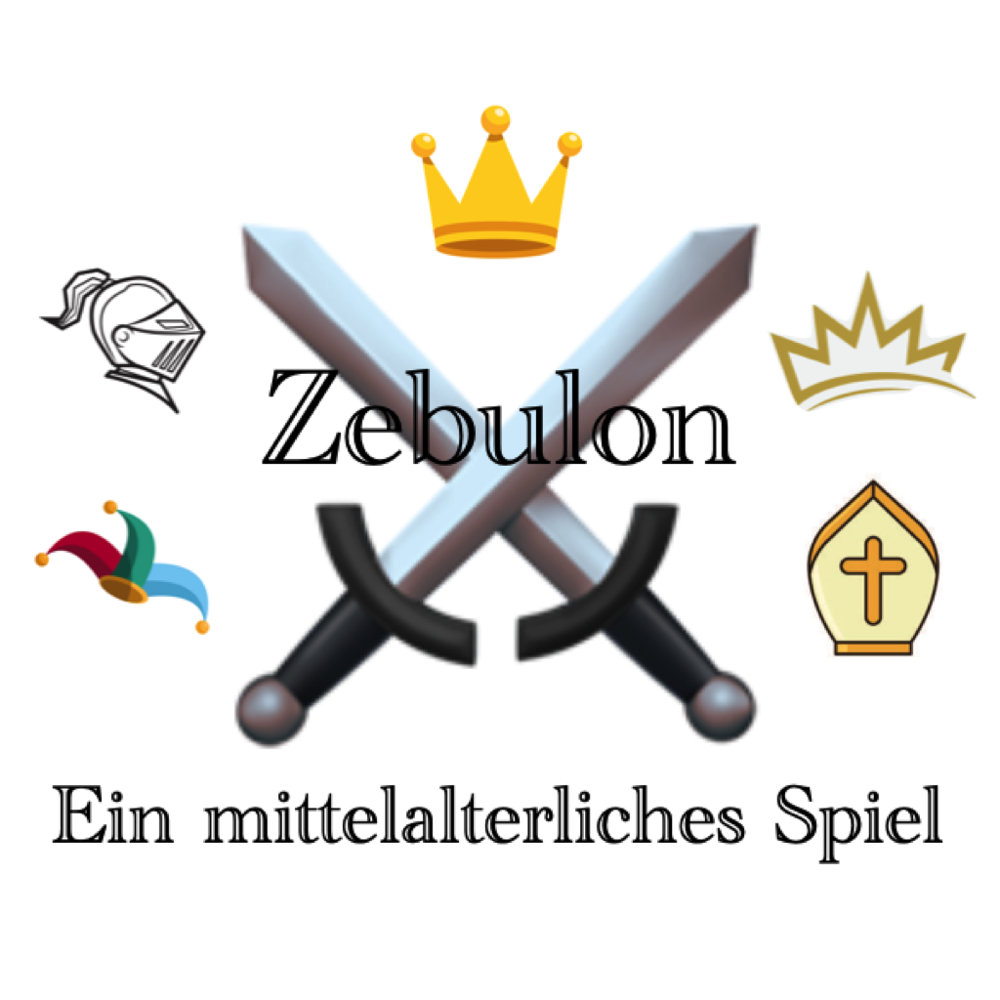

  

  

    

      
Zebulon

      

        Soon Available in <b>AppStore</b>! At Google Play, too!
        Bald Verfügbar im <b>AppStore</b>! Auch bei Google Play!
      

    

  

<h4>
  <b><i>Zebulon</i></b> — a medieval gamep.
  <b><i>Zebulon</i></b> — ein mittelalterliches Spiel.
</h4>

  In a large peaceful tournament, 5 nobles and 14 pawns from two kingdoms meet. On the great tournament ground, the white nobles set up their camps in the north and south, and the black nobles in the east and west. In the course of the tournament, the nobles, with the help of their pawns, try to connect their own camps opposite to each other.
  Bei einem großen friedlichen Turnier treffen 5 Edelleute und 14 Bauern zweier Königreiche aufeinander. Auf dem großen Turnierplatz schlagen die weißen Edelleute im Norden und Süden ihr Lager auf und die schwarzen im Osten und Westen. Im Laufe des Tuniers versuchen nun die Edelleute mit Hilfe ihrer Bauern ihre eigenen, sich gegenüberliegenden Lager zu verbinden.

&nbsp;

  Zebulon's <b><a href="PrivacyPolicy.html">Privacy Policy</a></b>
  Zebulons <b><a href="PrivacyPolicy.html">Datenschutz-Richtlinie</a></b> 

 

<h3>&nbsp;</h3>
